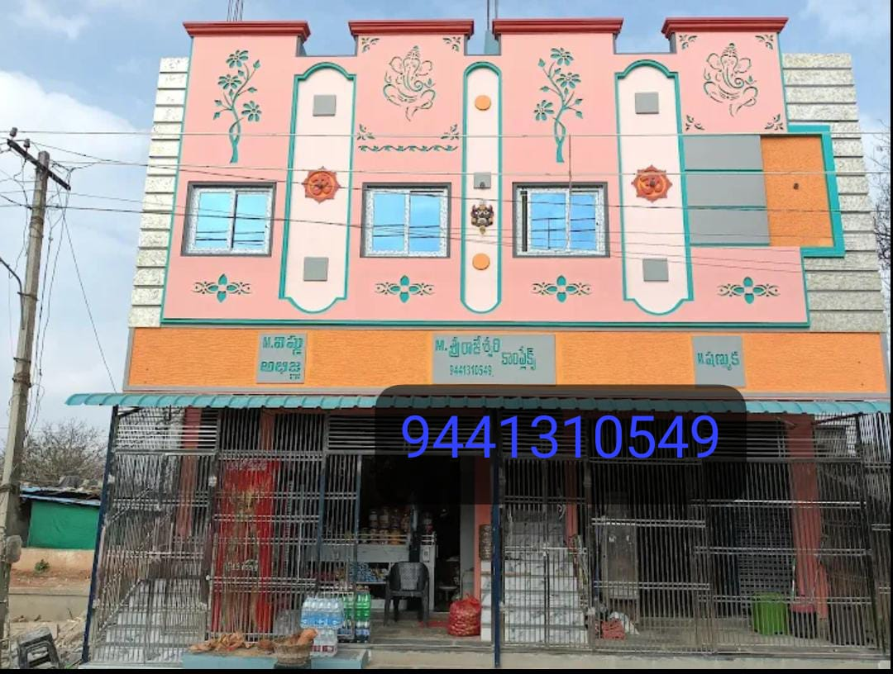

<!DOCTYPE html>
<html>
<head>
<title>Ahobilam Rooms</title>

<meta name="viewport" content="width=device-width, initial-scale=1.0">

</head>

<body>

<!-- ===== NAVBAR ===== -->

    

        
    

    <h1 class="site-title">Ahobilam</h1>

    

        

            <a href="#about">About</a>
            <a href="#hotels">Hotels</a>
            <a href="#temple">Temple Timings</a>
        

        
☰

        

    

<!-- ===== HEADER ===== -->
<header>
<h1>Ahobilam Rooms</h1>

<strong>Welcome to Ahobilam Rooms</strong> 
Your ideal accommodation near the sacred Ahobilam Temple.

</header>

<!-- ===== FACILITIES ===== -->
<section id="about">

<h2>Facilities</h2>

✅ AC & Non-AC Rooms 
✅ Hot Water 24 Hours 
✅ Parking Available 
✅ Family Friendly

<button onclick="location.href='tel:+917675962840'">
Call For Booking
</button>

</section>

<!-- ===== HOTEL CARD ===== -->
<section id="hotels">

<button class="complex-btn"
onclick="location.href='rooms.html'">
Rajeshwari Complex 
Book Now
</button>

</section>

</body>
</html>
