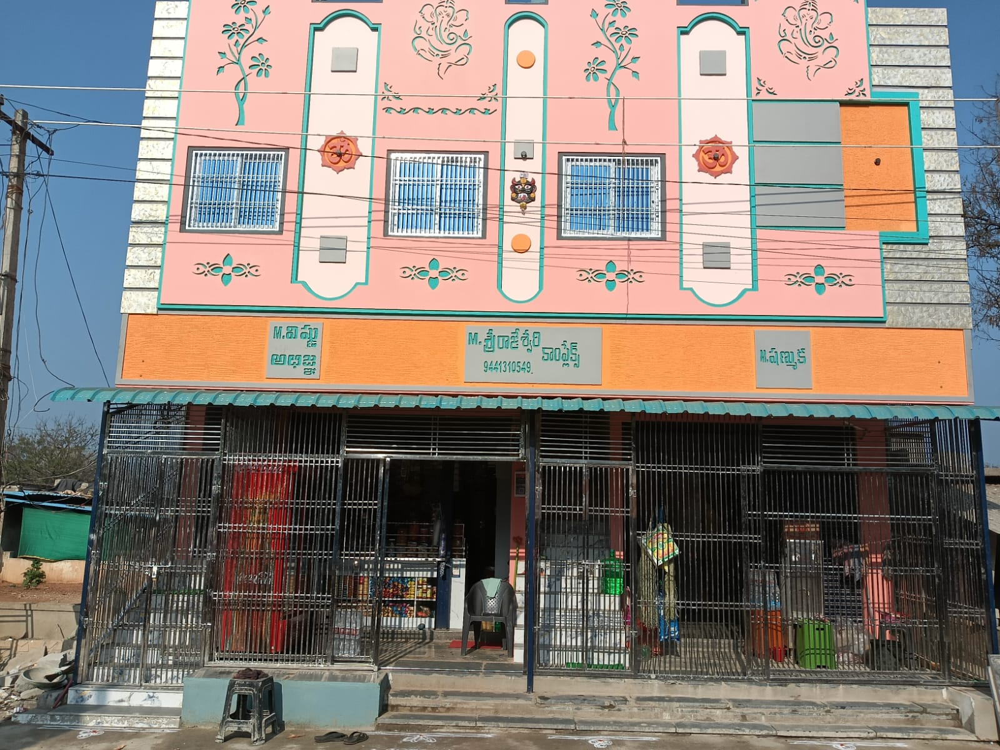
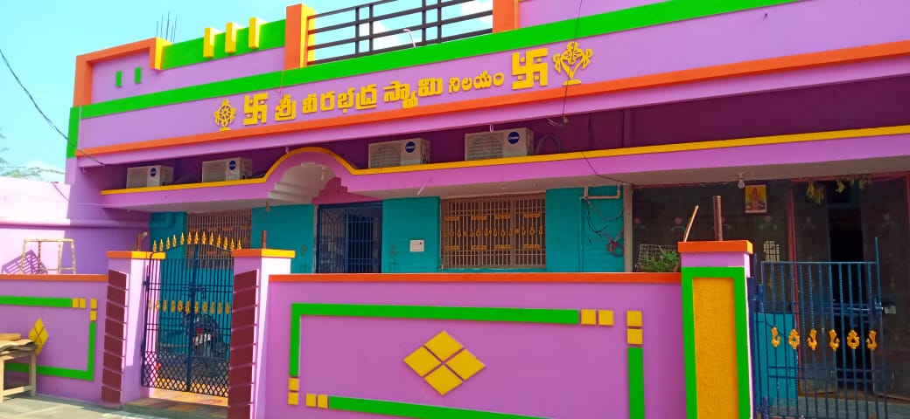

<!DOCTYPE html>
<html lang="en">
<head>
    <meta charset="UTF-8">
    <meta name="viewport" content="width=device-width, initial-scale=1.0">
    <title>Madham Rajeshwari Complex - Ahobilam</title>
    <!-- Fonts & Icons -->
    <link href="https://fonts.googleapis.com/css2?family=Playfair+Display:wght@400;600;700&family=Inter:wght@400;500;700&display=swap" rel="stylesheet">
    <link rel="stylesheet" href="https://cdnjs.cloudflare.com/ajax/libs/font-awesome/6.0.0/css/all.min.css">

    
</head>
<body>

    <!-- Header Section -->
    <header class="navbar">
        

            
            

                <h1>Madham Rajeshwari</h1>
                
COMPLEX

            

        

        <nav class="nav-links" id="nav-links">
            <a href="index.html" class="active">Home</a>
            <a href="rooms.html">Rooms</a>
            <a href="temple-history.html">Temple History</a>
            <a href="contact.html">Contact</a>
            <!-- Mobile Only Book Button -->
            <button class="book-now-btn desktop-hide" onclick="openBookingModal()">
                <i class="fa-solid fa-phone"></i> Book Now
            </button>
        </nav>

        

            <button class="book-now-btn" id="header-book-btn" onclick="openBookingModal()">
                <i class="fa-solid fa-phone"></i> Book Now
            </button>
            

                <i class="fa-solid fa-bars"></i>
            

        

    </header>

    <!-- Hero Section -->
    <section class="hero-section">
        

            
WELCOME TO

            <h1 class="hero-title">Madham Rajeshwari Complex</h1>
            
Ahobilam, Andhra Pradesh

            

                <a href="#" class="btn-whatsapp" onclick="openBookingModal(); return false;">Book via WhatsApp</a>
                <a href="#hotels" class="btn-outline">View Properties</a>
            

        

    </section>

    <!-- Properties Section -->
    <section id="hotels" class="hotels-section">
        <h2 class="section-title">Our Properties</h2>
        

            

                
                

                    <h3>Madham Rajeshwari Complex</h3>
                    
Experience comfortable stay with premium amenities near the sacred Ahobilam temples.

                    <a href="madam-rajeswari-complex.html" style="color:#dfb160; text-decoration:none; font-weight:bold; display:block; margin-top:15px;">Explore Complex →</a>
                

            

            

                
                

                    <h3>Veerabadhra Complex</h3>
                    
Your perfect base for a spiritual journey with excellent hospitality and care.

                    <a href="veerabadhra-complex.html" style="color:#dfb160; text-decoration:none; font-weight:bold; display:block; margin-top:15px;">Explore Hotel →</a>
                

            

        

    </section>

    <!-- Footer -->
    <footer class="footer">
        

            

                <h3>About Us</h3>
                
Providing divine hospitality near the sacred Nava Narasimha temples. Comfortable stay with modern amenities.

            

            

                <h3>Quick Links</h3>
                <ul style="list-style:none;">
                    <li><a href="index.html" style="color:#ccc; text-decoration:none;">Home</a></li>
                    <li><a href="rooms.html" style="color:#ccc; text-decoration:none;">Rooms</a></li>
                    <li><a href="contact.html" style="color:#ccc; text-decoration:none;">Contact</a></li>
                </ul>
            

            

                <h3>Contact Info</h3>
                <ul class="footer-contact">
                    <li><i class="fa-solid fa-location-dot"></i> Ahobilam, Andhra Pradesh, India</li>
                    <li><i class="fa-solid fa-phone"></i> +91 76759 62840</li>
                    <li><i class="fa-solid fa-envelope"></i> madhamvenkatasubbaiah363@gmail.com</li>
                </ul>
            

        

        

            &copy; 2026 Madham Rajeshwari Complex. All rights reserved.
        

    </footer>

    <!-- Booking Modal Form -->
    

        

            &times;
            <h3 style="color:#dfb160; font-family:'Playfair Display'; font-size:24px; margin-bottom:20px; text-align:center; border-bottom:1px dashed #444; padding-bottom:10px;">Book Your Stay</h3>
            
            <form id="whatsappBookingForm" onsubmit="sendWhatsApp(event)">
                

                    <label>Full Name *</label>
                    <input type="text" id="b_name" placeholder="Enter your name" required>
                

                

                    <label>Select Property *</label>
                    <select id="b_hotel" required>
                        <option value="Madham Rajeshwari Complex">Madham Rajeshwari Complex</option>
                        <option value="Veerabadhra Complex">Veerabadhra Complex</option>
                    </select>
                

                

                    

                        <label>Check-in *</label>
                        <input type="date" id="b_checkin" required>
                    

                    

                        <label>Check-out *</label>
                        <input type="date" id="b_checkout" required>
                    

                

                

                    

                        <label>Persons *</label>
                        <input type="number" id="b_persons" min="1" value="1" required>
                    

                    

                        <label>Room Type *</label>
                        <select id="b_roomtype" required>
                            <option value="AC Room">AC Room</option>
                            <option value="Non-AC Room">Non-AC Room</option>
                        </select>
                    

                

                <button type="submit" class="submit-wa-btn">
                    <i class="fa-brands fa-whatsapp"></i> Send Booking Request
                </button>
            </form>
        

    

    
</body>
</html>
