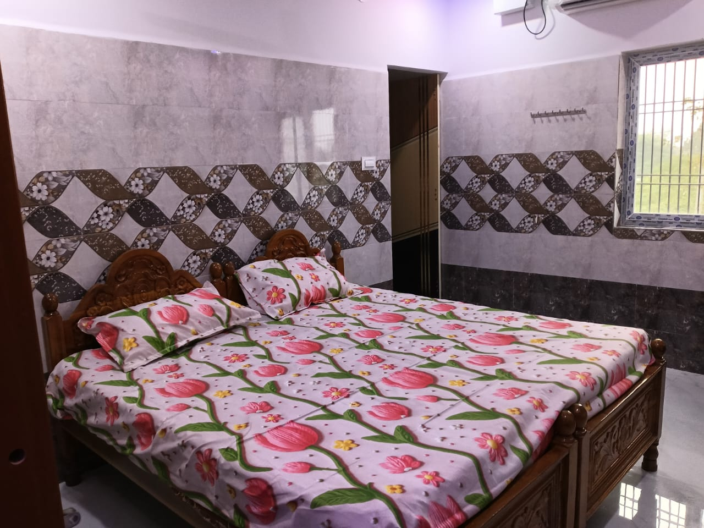
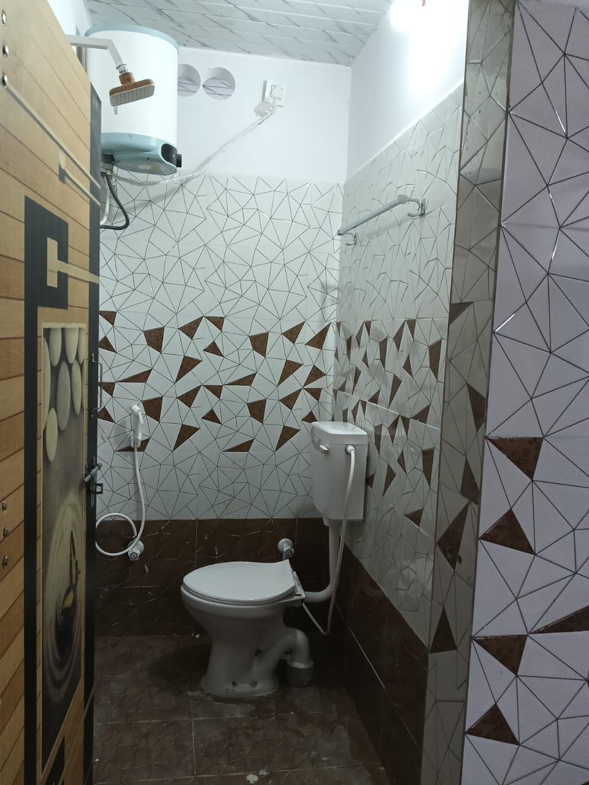
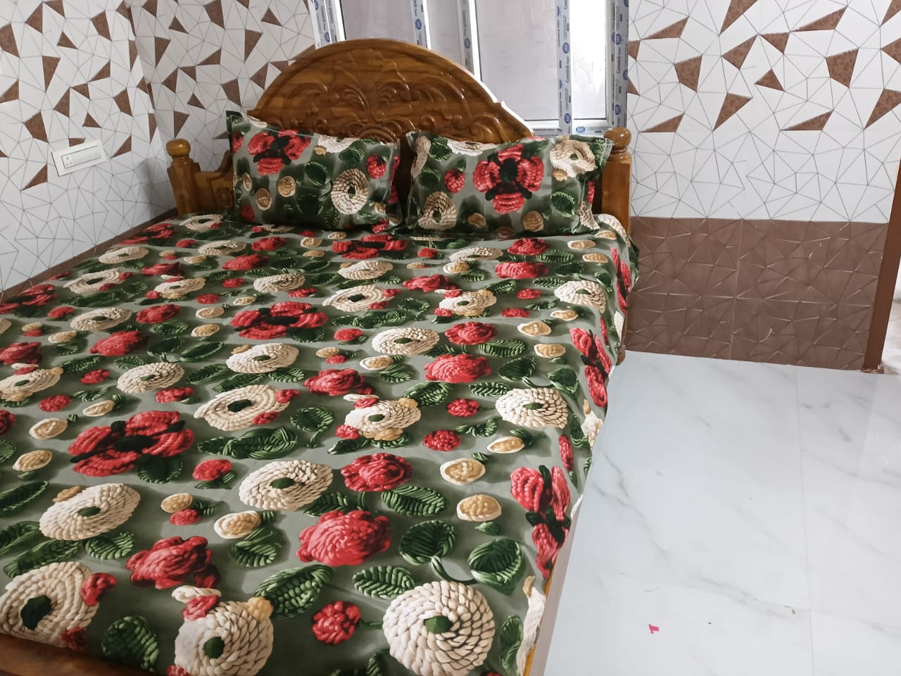

<!DOCTYPE html>
<html>
<head>

<meta name="viewport" content="width=device-width, initial-scale=1.0">
<title>Ahobilam Rooms</title>

</head>

<body>

<!-- NAVBAR -->

<h2 style="color:white;margin:0;">AHOBILAM</h2>

<a href="#" onclick="openPanel('aboutPanel')">About</a>
<a href="#" onclick="openPanel('hotelsPanel')">Hotels</a>
<a href="#" onclick="openPanel('timingsPanel')">Temple Timings</a>

<!-- HEADER -->
<header>
<h1>Ahobilam Rooms</h1>

<strong>Welcome to Ahobilam Rooms</strong> 
Your ideal accommodation near the sacred temple

</header>

<!-- FACILITIES -->
<section>

<h2>Facilities</h2>

🛏 AC & Non-AC Rooms 
🚿 Hot Water 24 Hours 
🚘 Parking Available 
👨‍👩‍👦 Family Friendly

<button onclick="location.href='tel:+917675962840'">
Call For Booking
</button>

</section>

<!-- COMPLEX -->

  
<button onclick="openPanel('roomsPanel')">
Rajeshwari Complex - Book Now
</button>

<!-- ROOMS PANEL -->

<button onclick="goHome()">⬅ Back</button>

<h2>Rajeshwari Complex</h2>

<!-- 3 BED -->

<h3>3 Bed Room</h3>

AC + WiFi

<button onclick="location.href='tel:+917675962840'">
Book ₹1600
</button>

<!-- 2 BED -->

<h3>2 Bed Room</h3>

AC + WiFi

<button onclick="location.href='tel:+917675962840'">
Book ₹1200
</button>

<!-- PANELS -->

<button onclick="goHome()">⬅ Back</button>
<h2>About</h2>

Best stay near temple.

<button onclick="goHome()">⬅ Back</button>
<h2>Hotels</h2>

Coming soon

<button onclick="goHome()">⬅ Back</button>
<h2>Temple Timings1</h2>

Morning: 7AM - 1PM Afternoon: 2PM - 5PM

<!-- WHATSAPP -->
<a class="whatsapp"
href="https://wa.me/917675962840?text=Hi%20I%20want%20room"
target="_blank">💬</a>

</body>
</html>
